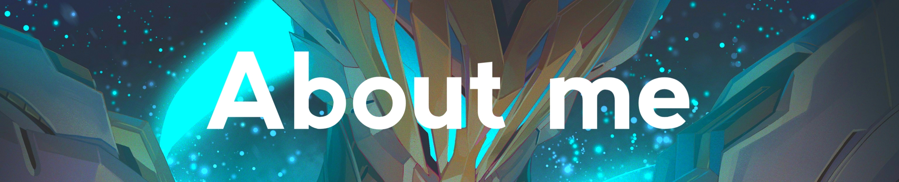

  

  

  
   
   

  - Name **Ramadina Al Muzthazam**
  
  - Live in **Jakarta Timur**
  
  - Familiar with **Illustrator** and **Photoshop**
  
  - Good with **JavaScript**, **PHP**, **React**, **Laravel** and **THREE.js**

  
   
   

  - 📗 [***ramarfx/rebellum***](https://github.com/ramarfx/rebellum)  
  landing page with the theme of juvenile delinquency created in the context of the 2024 AWS static web competition
  - 📘 [***ramarfx/e-mading***](https://github.com/ramarfx/e-mading)  
  a web application created in the context of the LigaSMK x WPU competition with the theme of online announcements such as wall magazines
- 📙 [***ramarfx/inditech***](https://indi.tech)  
  Indi.tech - 3D landing page created using THREE.js for industrial class activities from PT. Indi Technology
  

